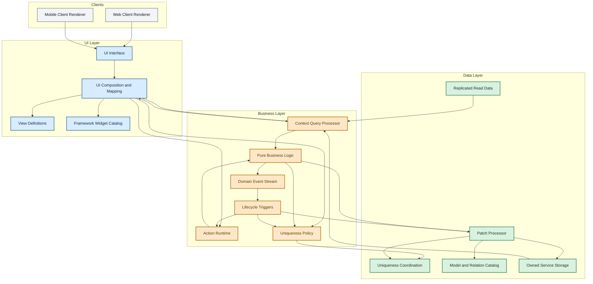
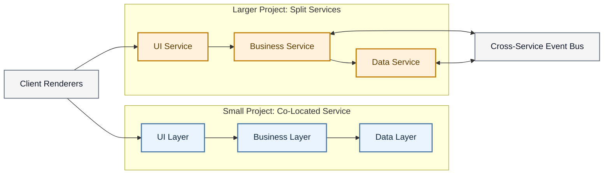
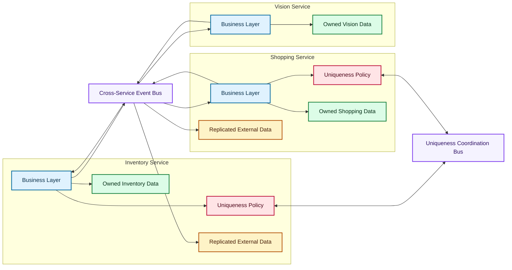
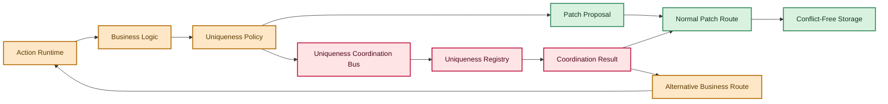

# State Mach Service Architecture

This document captures the current service-architecture direction for the `State Mach` framework and the first `Home Inventory` product.

## Design Intent

- `State Mach` is split into three layers with strict responsibility boundaries:
  - `UI`
  - `Business`
  - `Data`
- UI configuration processing should happen on the server side.
- Web and mobile clients should share common UI server processing and differ mainly in rendering and interaction handling.
- Small projects may run the three layers inside one service.
- Larger projects may split layers into independently deployed services.
- Cross-service synchronization should prefer the event bus over synchronous calls.

## Diagram Sources

### Core Layered Service

### Co-Located vs Split Deployment

### Cross-Service Ownership and Event Interchange

### Uniqueness Coordination Processing

## Notes

- The `UI Layer` owns view composition, widget selection, and data-to-widget mapping, but not widget implementation.
- The `Business Layer` owns actions, lifecycle triggers, event production, pure-function logic evaluation over `params + context tree`, and uniqueness policy definition.
- The `Data Layer` owns model metadata, uniqueness coordination primitives, patch application, authoritative storage, and replicated read-side data.
- Uniqueness should not rely on transaction failures as a normal control-flow mechanism. Business logic should be able to define alternative routes for uniqueness-violation outcomes.
- The same logical architecture should work whether the layers are deployed together or separately.
