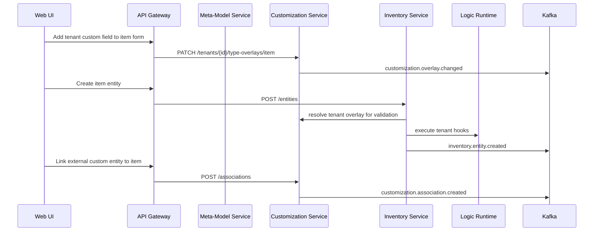

# Work Breakdown and Backlog

## Epic 1: Platform Bootstrap
### Work items
- E1-W1: Create repo structure (`services/`, `deploy/`, `libs/`, `ui/`, `docs/`).
- E1-W2: k3s install scripts for your servers.
- E1-W3: Deploy Postgres and Kafka manifests.
- E1-W4: Add API gateway with route config.
- E1-W5: Add CI pipeline (lint/test/build image).
- E1-W6: Deploy OTEL Collector and wire gateway telemetry.
- E1-W7: Add initial Grafana dashboards (latency/error/throughput).

### Deliverables
- Running cluster baseline.
- Infrastructure runbook.

## Epic 2: Dynamic Meta-Model Foundation
### Work items
- E2-W1: Design `entity_types` and `entity_fields` schema.
- E2-W2: Implement Meta-Model service APIs.
- E2-W3: Implement universal `entities` table + validation layer.
- E2-W4: Define relationship-as-entity conventions.
- E2-W5: Add JSONB index strategy and benchmark scripts.

### Deliverables
- Runtime model management and validated universal entities.

## Epic 3: Identity, Settings, and Secrets
### Work items
- E3-W1: Implement `auth-service` (register/login/JWT refresh).
- E3-W2: Implement `user-service` profile + roles (basic now).
- E3-W3: Implement `settings-service` preferences.
- E3-W4: Configure secrets workflow (SOPS + Kubernetes Secrets).

### Deliverables
- Authenticated API calls and secret lifecycle.

## Epic 4: Inventory Core on Universal Model
### Work items
- E4-W1: Define inventory entity types (item/category/location/item_in_location).
- E4-W2: CRUD endpoints using universal model.
- E4-W3: Stock event processing with idempotency key.
- E4-W4: Publish inventory Kafka events.
- E4-W5: Build initial UI screens with dynamic forms.

### Deliverables
- Usable inventory management flow using dynamic entities.

## Epic 5: Tenant Customization Service
### Work items
- E5-W1: Create `customization-service` boundary and ownership contracts.
- E5-W2: Implement tenant type overlays and view overlays APIs.
- E5-W3: Implement extension entity association APIs.
- E5-W4: Add overlay resolution layer (OOTB + tenant).
- E5-W5: Add tenant isolation and quota guardrails.

### Deliverables
- Tenant-specific customization without modifying OOTB service internals.

## Epic 6: Dynamic Logic Runtime
### Work items
- E6-W1: Define logic package format and lifecycle.
- E6-W2: Implement hook executor (`before_update`, `after_update`, etc.).
- E6-W3: Implement tenant-scoped package activation and rollback.
- E6-W4: Add audit logs for logic changes.

### Deliverables
- Runtime custom logic updates without redeploy.

## Epic 7: Vision and Enrichment
### Work items
- E7-W1: Image ingest endpoint and storage abstraction.
- E7-W2: Candidate extraction pipeline.
- E7-W3: Web lookup and normalization.
- E7-W4: Human confirmation UI.

### Deliverables
- Photo-to-entity onboarding flow.

## Epic 8: Replenishment and Shopping
### Work items
- E8-W1: Low-stock/perished detection rules.
- E8-W2: Shopping list domain and APIs.
- E8-W3: Supplier/source connector abstraction.
- E8-W4: UI shopping workflows.

### Deliverables
- Auto-generated, editable shopping list.

## Epic 9: Analytics and AI
### Work items
- E9-W1: Consumption aggregation jobs.
- E9-W2: Prediction endpoint (reorder date forecast).
- E9-W3: Assistant API intent contracts.
- E9-W4: Assistant UI with action confirmations.

### Deliverables
- Forecasts and AI-guided operations.

## Epic 10: Reliability and Access Control (Later)
### Work items
- E10-W1: Observability stack integration.
- E10-W2: Backup/restore verification.
- E10-W3: Advanced access control model design.
- E10-W4: Hardening checklist and load smoke tests.
- E10-W5: Define service scaling tiers and min replica policy.
- E10-W6: Implement HPA/KEDA policies and scale-from-zero tests.
- E10-W7: Validate cold-start budget and apply pre-warm strategy.

### Deliverables
- Stable prototype with clear security roadmap.

## Epic 11: Migration Governance (Model/Data + Platform)
### Work items
- E11-W1: Define model/data migration contract (inputs, validators, rollback, audit).
- E11-W2: Implement migration runner for entity/model/version migrations.
- E11-W3: Add business UI migration compatibility checks.
- E11-W4: Define platform migration playbooks per component (gateway, kafka, postgres, runtime).
- E11-W5: Add migration approval workflow and change classification rules.
- E11-W6: Run scheduled migration drills and capture RTO/RPO + rollback metrics.

### Deliverables
- Two independent migration pipelines with documented controls and rehearsed rollback.

## Cross-Cutting Definition of Done
- Unit tests for domain logic.
- API contracts documented (OpenAPI).
- Compatibility tests for type/logic versions.
- Structured logging + trace IDs.
- Basic security checks (authz, input validation).
- OTEL traces/metrics emitted for new service endpoints.
- Every change is tagged as `model/data migration` or `platform migration`.

## Suggested First Sprint (10 business days)
1. E1-W1, E1-W2, E1-W3
2. E1-W6, E1-W7
3. E2-W1, E2-W2, E2-W3
4. E4-W1 (minimal set), E4-W2 (item only)
5. Minimal UI: login + item list + add item with dynamic form

## OOTB + Customization Interaction View

