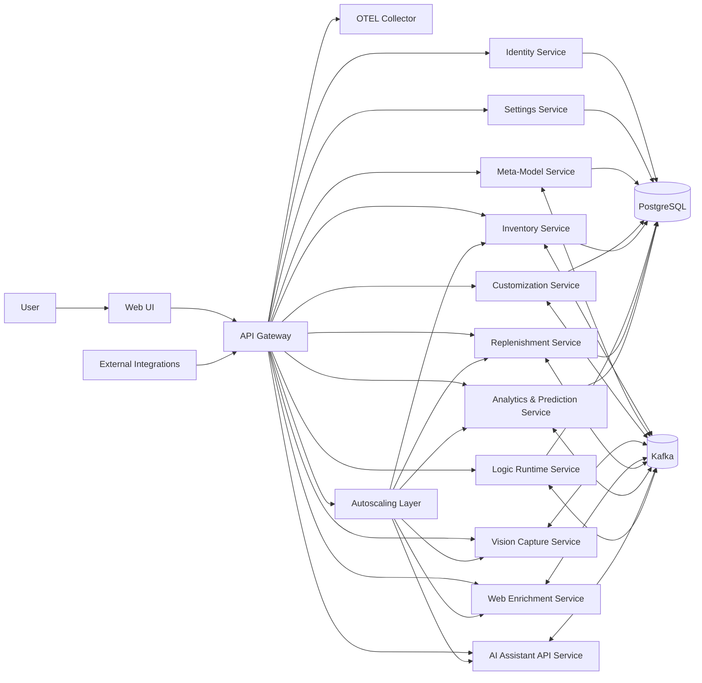

# Inventory + Cloud PLM Prototype: Top-Level Specification

## 1. Vision
Build a production-shaped platform that serves two outcomes:
- Immediate: household inventory manager with daily operational value.
- Strategic: reusable Cloud PLM prototype architecture.

The system is self-hosted first on small private servers (no public cloud dependency in initial phases).

## 2. Guiding Principles
- Rust-first for backend services.
- Kubernetes-native deployment model.
- Event-driven integration via Kafka.
- Dynamic, runtime-extensible entity model.
- Tenant-specific customization with strict isolation.
- OTEL-native observability from day one.
- Elastic scaling with selective scale-to-zero.
- AI as modular capabilities, not hard-coded into core workflows.
- Cloud-portable architecture (local-first now, cloud later).

## 3. Scope (Top Level)
### In Scope
- Identity and access (user management now, advanced access control later phase).
- Settings and secrets management.
- API Gateway.
- Inventory domain services.
- Vision ingestion/classification service.
- Web enrichment service (product facts, categorization metadata).
- Replenishment/shopping recommendation service.
- Analytics + prediction service.
- AI assistant + integration API.
- Web UI.
- Observability and ops baseline.

### Out of Scope (Initial)
- Full enterprise PLM workflows (advanced approvals, compliance modules).
- Public cloud managed services.
- Native mobile app.

## 4. High-Level Architecture

## 5. Data Architecture: Tenant DB + Service Schema + Type Table
Persistence boundaries:
- Tenant isolation by database.
- Service ownership by schema inside tenant database.
- Entity type by dedicated table inside service schema.
- Entity identity in storage by table-local `BIGINT` primary key.

Identity model:
- Canonical global identity segments are `tenant.service.type.id`.
- Composite global ID is mostly for logs, tracing, events, and cross-service audit.
- Product CRUD APIs primarily use numeric table-local `id`.

Routing and auth model:
- API gateway path encodes service boundary (example: `/inventory/...`).
- Tenant context is resolved from authenticated session/token claims.
- Services enforce tenant scope from trusted auth context, not client-provided tenant fields.

## 6. Service Catalog
### 6.1 API Gateway
- Single entry point for UI + external clients.
- JWT validation, routing, rate limiting, request tracing.

### 6.2 Identity Service
- User registration/invite/login.
- Roles/permissions (fine-grained access control added later phase).
- Token issuing/introspection.

### 6.3 Settings Service
- User preferences.
- Household/workspace settings.

### 6.4 Meta-Model Service
- Manage runtime entity types and field definitions.
- Version type definitions and publish type-change events.
- Serve canonical model representation for UI and integrations.

### 6.5 Customization Service
- Tenant-scoped model overlays (extra fields/types/views) over OOTB definitions.
- Tenant-scoped logic bindings and activation policy.
- External extension entities that associate to OOTB entities.
- Cross-service orchestration via events, without direct ownership takeover of OOTB data.

### 6.6 Logic Runtime Service
- Runtime-updatable custom logic (rules/policies/actions).
- Logic package versioning and activation.
- Controlled execution sandbox and audit logs.

### 6.7 Inventory Service (Core)
- CRUD over entities of inventory-related types.
- Stock events (add/consume/adjust/move/dispose).
- Low-stock and perishability tracking.

### 6.8 Vision Capture Service
- Accept image(s), detect item candidates.
- Return confidence-scored item suggestions.
- Publish candidate events.

### 6.9 Web Enrichment Service
- Fetch product metadata from web sources.
- Normalize brand/model/category/package sizes.
- Publish enrichment events.

### 6.10 Replenishment Service
- Detect missing/perished/low-stock items.
- Build shopping list and sourcing suggestions.
- Publish `shopping.list.updated` events.

### 6.11 Analytics & Prediction Service
- Usage trends, burn rate, stockout risk.
- Predict reorder timing.

### 6.12 AI Assistant API Service
- Natural language Q&A over inventory and trends.
- Action orchestration (e.g., “add milk to list”).
- Stable API for external AI integrations.

### 6.13 Web UI
- Inventory dashboard.
- Scan/upload flows.
- Shopping and insights views.
- Assistant panel.
- Dynamic forms generated from model representation.

## 7. Model Representation
Canonical model representation will be exposed as JSON documents by the Meta-Model Service:
- `EntityType` (name, version, lifecycle)
- `FieldDefinition` (key, data_type, required, constraints)
- `RelationDefinition` (source_type, target_type, semantics)
- `ViewDefinition` (default table/list/filter config for UI)
- `LogicBinding` (which logic package applies to which type/event)

Tenant-specific overlays are exposed by the Customization Service:
- `TypeOverlay` (tenant_id, base_type, added/hidden fields)
- `ViewOverlay` (tenant-specific forms/tables/filters)
- `PolicyOverlay` (tenant-specific constraints and allowed actions)
- `AssociationType` (how extension entities link to OOTB entities)

Source-of-truth authoring format for service models:
- one TOML file per entity type (`models/<service>/*.model.toml`)
- comments allowed for maintainability
- format is specified in `docs/spec/entity-definition-format.md`

## 8. Runtime Custom Logic Update
Target mechanism:
- Logic packages are uploaded/versioned (WASM or DSL-driven rule bundles).
- Activation is dynamic by config, no service redeploy required.
- Rollback to prior logic version must be one command/API call.

Safety constraints:
- Resource limits and timeout on logic execution.
- Event replay compatibility checks before activation.
- Full audit trail for who changed logic and when.

Tenant behavior:
- OOTB logic remains default and immutable for stability.
- Tenant logic is additive/override by explicit precedence rules.
- Tenant logic execution is isolated by tenant context and quotas.

## 9. Tenant-Specific Customization Model
- OOTB services own core entity lifecycles and invariants.
- Customization Service owns tenant extensions and can associate extension entities to OOTB entities.
- Association pattern: extension entity stores links to core entity IDs and optional denormalized snapshots.
- Preferred integration path is event-driven; direct synchronous write into OOTB services is restricted by API contracts.

## 10. Migration Strategy (Two Levels)
### 10.1 Model/Data Migration
Purpose:
- Evolve business model, stored data, business logic, and business UI behavior.

Scope:
- Type/version changes in meta-model and tenant overlays.
- Data backfill/reshape/mapping across entity versions.
- Logic hook updates and compatibility validation.
- UI form/view updates driven by model representation.

Requirements:
- Forward and backward compatibility policy per entity type.
- Idempotent migration jobs with checkpoints.
- Dry-run mode, validation reports, and automatic rollback plan.
- Migration events published for observability and replay.

### 10.2 Platform Migration
Purpose:
- Change internal machinery without changing business intent.

Scope:
- Framework/runtime upgrades, infrastructure components, deployment model, look and feel refresh.
- Internal service refactors, build/CI/CD pipeline changes, platform-level libraries.

Requirements:
- Zero/low-downtime rollout strategy (canary or blue/green).
- Performance regression budget and SLO gate.
- Full rollback playbook per platform component.
- Compatibility with existing model/data migration pipelines.

## 11. Data + Event Model (Top Level)
### Primary data domains
- Users and roles
- Settings
- Meta-model definitions
- Tenant overlays and extension metadata
- Service-owned relational entity tables
- Inventory events
- Shopping lists and recommendations
- Predictions and analytics snapshots
- Logic package metadata

### Kafka topics (initial draft)
- `model.type.changed`
- `customization.overlay.changed`
- `logic.package.published`
- `logic.package.activated`
- `customization.association.created`
- `inventory.entity.created`
- `inventory.entity.updated`
- `inventory.stock.changed`
- `vision.item_candidate.detected`
- `enrichment.item.updated`
- `shopping.list.updated`
- `analytics.prediction.generated`
- `assistant.action.requested`
- `assistant.action.completed`
- `service.scale.event` (optional operational topic)

## 12. Non-Functional Requirements
- Availability target for home lab: >= 99% monthly (best effort).
- P95 API latency target (core read paths): < 300 ms in local cluster.
- End-to-end traceability across gateway and services.
- Distributed traces, metrics, and structured logs collected through OTEL.
- Backups for Postgres (daily snapshot + WAL archival where feasible).
- Idempotent consumers for Kafka event handling.
- Tenant customization isolation: one tenant's model/logic changes must not affect others.
- Cold start budget for scale-from-zero services: target P95 < 1.5s.
- Dual migration governance: model/data migration and platform migration must be independently executable.

## 13. Security Requirements
- JWT-based auth at gateway.
- Coarse RBAC initially; advanced access control model in later phase.
- Encrypted in-transit traffic.
- Secret rotation process documented.
- Audit log for critical inventory/admin/model/logic actions.
- Separate permissions for OOTB model changes vs tenant overlay changes.
- Separate approvals for model/data migrations vs platform migrations.

## 14. Deployment Model (Initial)
- Kubernetes cluster on private servers (k3s recommended for simplicity).
- Containerized Rust services.
- Postgres stateful deployment with persistent volumes.
- Kafka deployment suitable for low-scale home usage.
- GitOps-friendly manifests (Helm or Kustomize).
- OTEL Collector as cluster telemetry ingestion point.
- Prometheus + Grafana + Loki/Tempo (or equivalent) for monitoring and tracing.
- KEDA/HPA for autoscaling decisions; scale-to-zero enabled for selected async/non-critical services.

Scale policy tiers:
- Tier 1 (always warm, min replicas >= 1): API Gateway, Identity, Inventory write path, Meta-Model.
- Tier 2 (burstable, min replicas 0-1): AI Assistant API, Enrichment, Analytics read/report jobs.
- Tier 3 (event-driven scale-to-zero): batch/consumer workloads and periodic processors.

## 15. Success Criteria (Phase 1)
- User can maintain live household inventory with less than 2 min/item onboarding average.
- New business field/type can be added at runtime without DB migration.
- Logic rule update can be activated and rolled back without service redeploy.
- Tenant-specific overlay can add a field/view without impacting OOTB service behavior.
- System auto-generates actionable shopping list for low/missing/perished items.
- OTEL dashboards show service health, latency, and error trends across all services.
